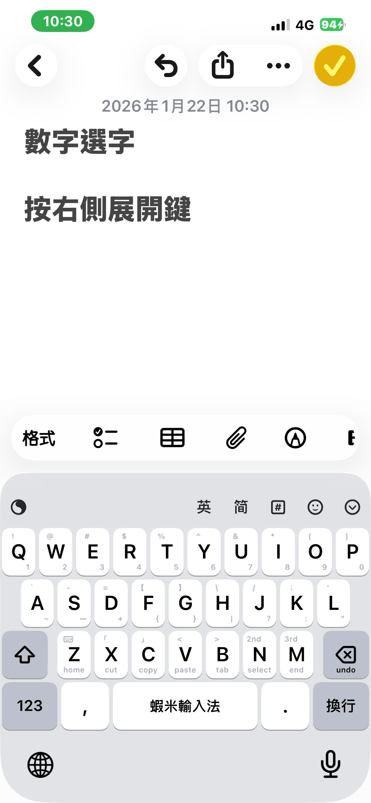

# 候選字操作

## 選字方式

1. **空格選字**：按空格鍵選擇第一個候選字
2. **點擊選字**：直接點擊想要的候選字
3. **數字選字**：下滑 Q～P 鍵（對應 1～9）選擇對應候選字
4. **按右側展開鍵**：顯示更多候選字

## 相關手勢

- [常用手勢：選字](/daily-use/gestures-common.md)
- [同音選字](/features/homophone.md)
- [聯想字](/features/prediction.md)
