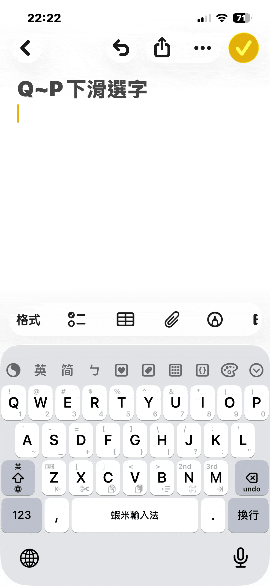
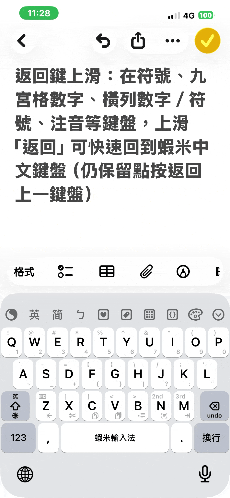

# 常用手勢

日常最常用的手勢一覽。更多進階手勢請見 [完整手勢](gestures-full.md)。

## 一覽圖

| 編號 | 手勢 | 功能 |
|:----:|------|------|
| ① | 空格 點按 | 選第 1 候選 |
| ② | 點候選字 | 直接上屏 |
| ③ | Q～P 下滑 | 選第 1～0 候選／輸出數字 1～0 |
| ④ | Shift 上滑 | 切換中／英鍵盤 |
| ⑤ | Shift 下滑 | 切換下一個輸入法（無地球機型） |
| ⑥ | 123 上滑 | 符號鍵盤 |
| ⑦ | 123 下滑 | 九宮格數字 |
| ⑧ | Enter 上滑 | 注音鍵盤 |
| ⑨ | 逗號 , 下滑 | 顏文字鍵盤 |
| ⑩ | 句號 . 下滑 | Emoji 鍵盤 |
| ⑪ | Z～M 下滑 | Z 句首／X 剪／C 複／V 貼／B Tab／N 全選／M 句尾 |
| ⑫ | Delete 左滑 | 清除目前字碼 |
| ⑬ | 空格 上滑 | 切換擴充字集 |
| ⑭ | Enter 下滑 | 換行 |

> **註**：符號／數字／注音等鍵盤的「**返回**」鍵上滑，可回到蝦米中文鍵盤（一覽圖下方藍字說明；此手勢不在主鍵盤上標號）。

---

## ①～③ 選字

### 空格與點選候選

- **空格**：選第 1 候選
- **點候選字**：直接上屏

### Q～P 下滑選字

候選區**有字**時，Q～P 下滑可選第 1～0 候選（亦會輸出數字 1～0）。

---

## ④～⑦ 切換鍵盤

> **註**：在符號、九宮格、注音等**其他鍵盤**上，「**返回**」鍵上滑可快速回到蝦米中文（見上方一覽圖下方說明）。

---

## ⑧～⑩ 快捷面板

---

## ⑪～⑭ 編輯與系統

---

[→ 完整手勢（進階）](gestures-full.md)
