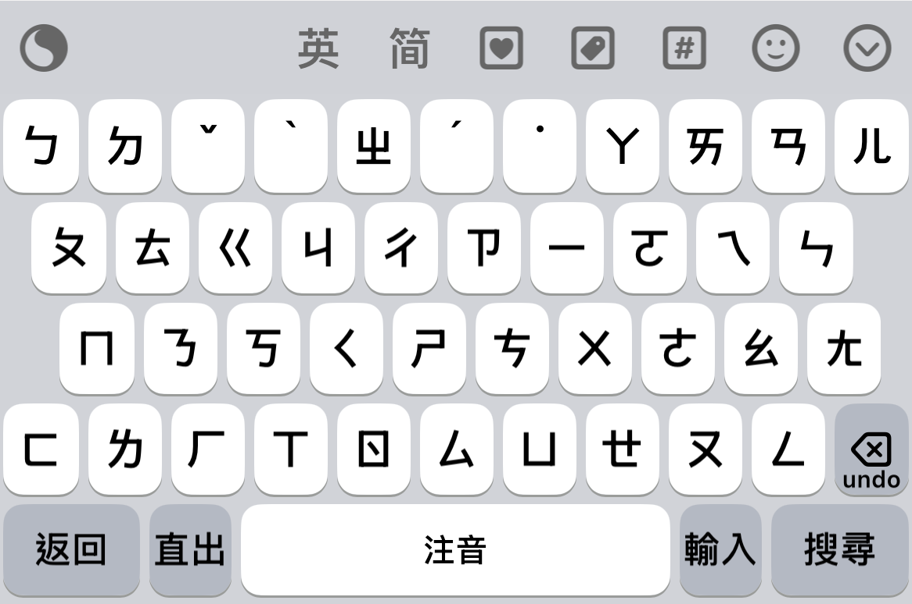
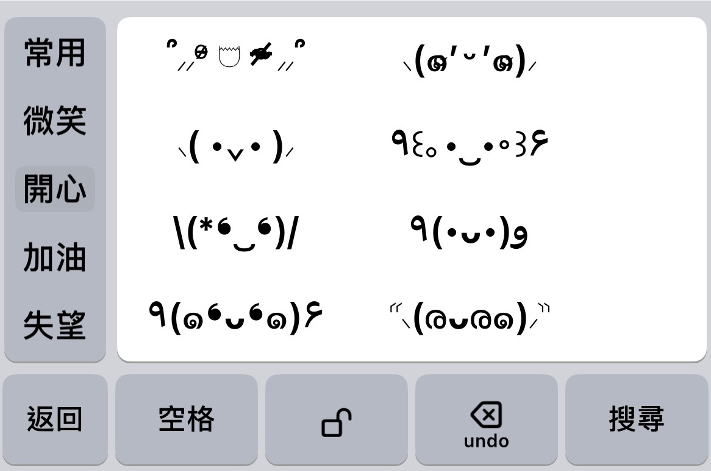
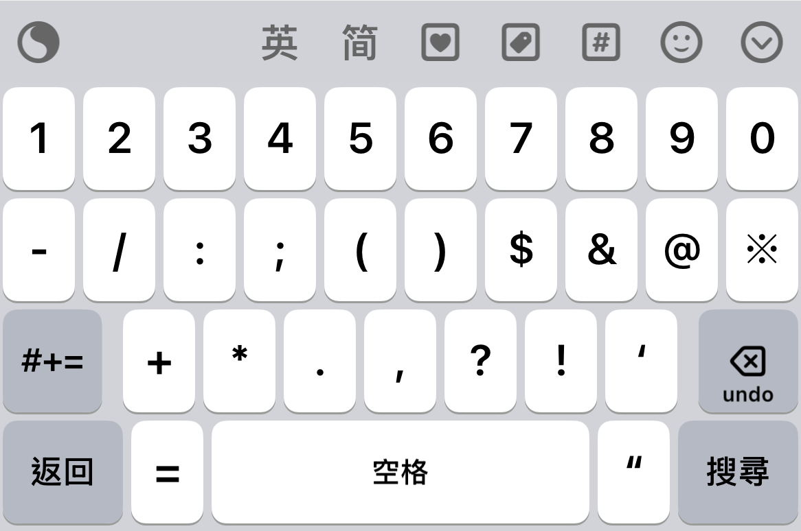
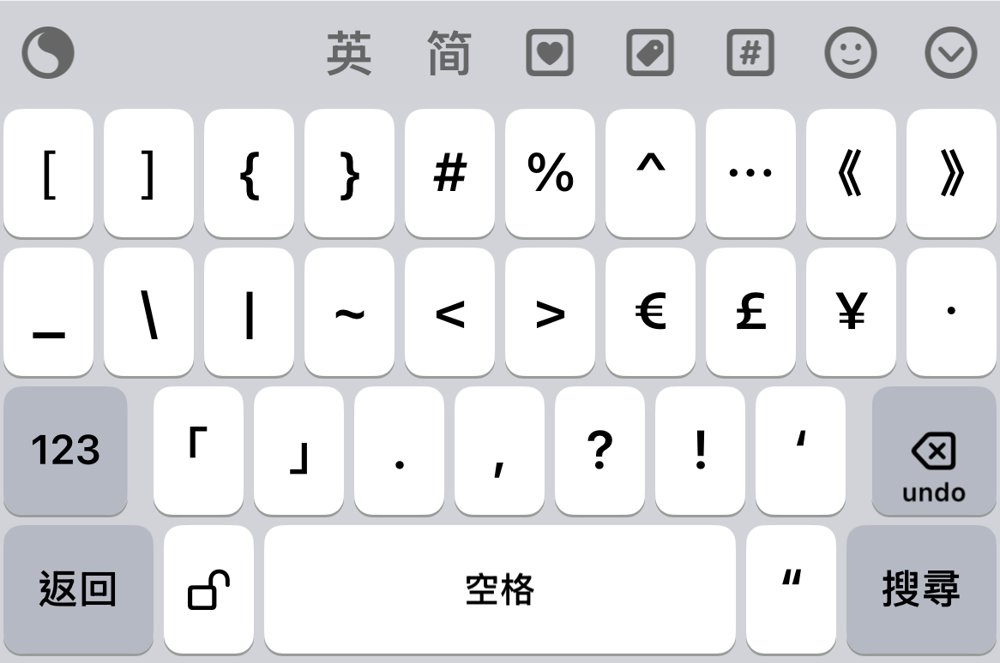
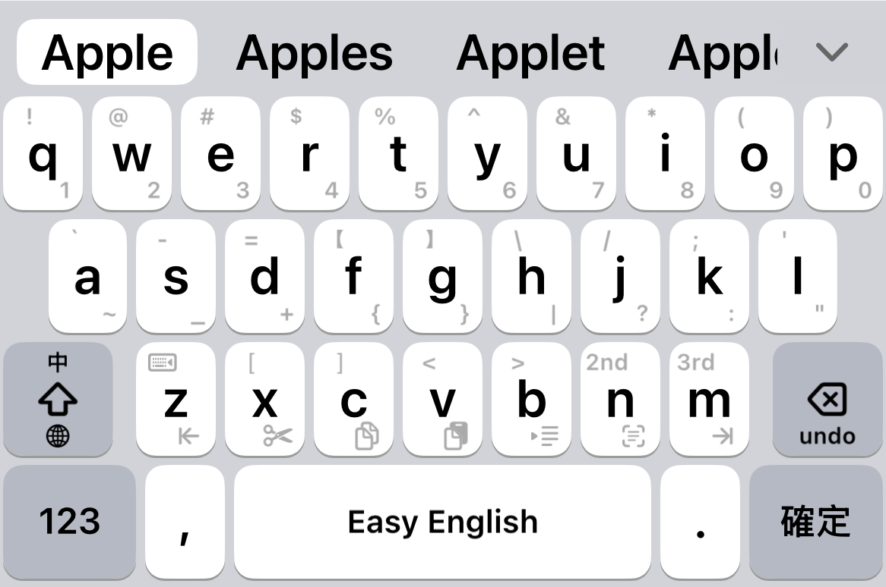

# 鍵盤佈局

## 主要區域

- **候選字區**：顯示輸入候選字
- **工具列**：快速功能按鍵
- **功能鍵區**：Shift、123、空格、Enter、Backspace
- **字母鍵區**：QWERTY 配置

## 其他鍵盤類型

除主畫面蝦米 26 鍵外，另包含下列鍵盤（可經工具列、手勢或皮膚設計器預覽切換）：

| 鍵盤 | 說明 | 手勢切換方式 |
|------|------|----------------|
| **注音** | 注音符號輸入 | 主鍵盤 **Enter 上滑** |
| **顏文字** | Kaomoji 面板 | 主鍵盤 **逗號下滑** |
| **橫列數字** | 數字橫排（可與九宮格數字併存） | — |
| **九宮格數字** | 九宮格數字（可與橫列數字併存） | 主鍵盤 **123 鍵下滑** |
| **符號面板** | 分類符號表 | — |
| **橫列符號** | 符號橫排 | — |
| **Emoji** | 表情符號 | 主鍵盤 **句號下滑** |
| **純英文／詞庫英文** | 依皮膚設計器設定 | Shift 上滑等 |

### 注音鍵盤

### 顏文字鍵盤

### 橫列數字鍵盤

### 橫列符號鍵盤

### 英文詞庫鍵盤

## 相關章節

- [常用手勢](gestures-common.md)
- [工具列](toolbar.md)
