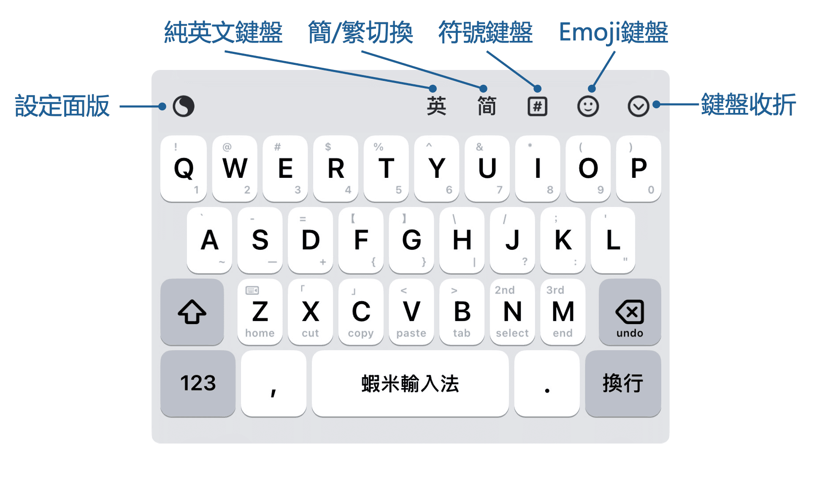
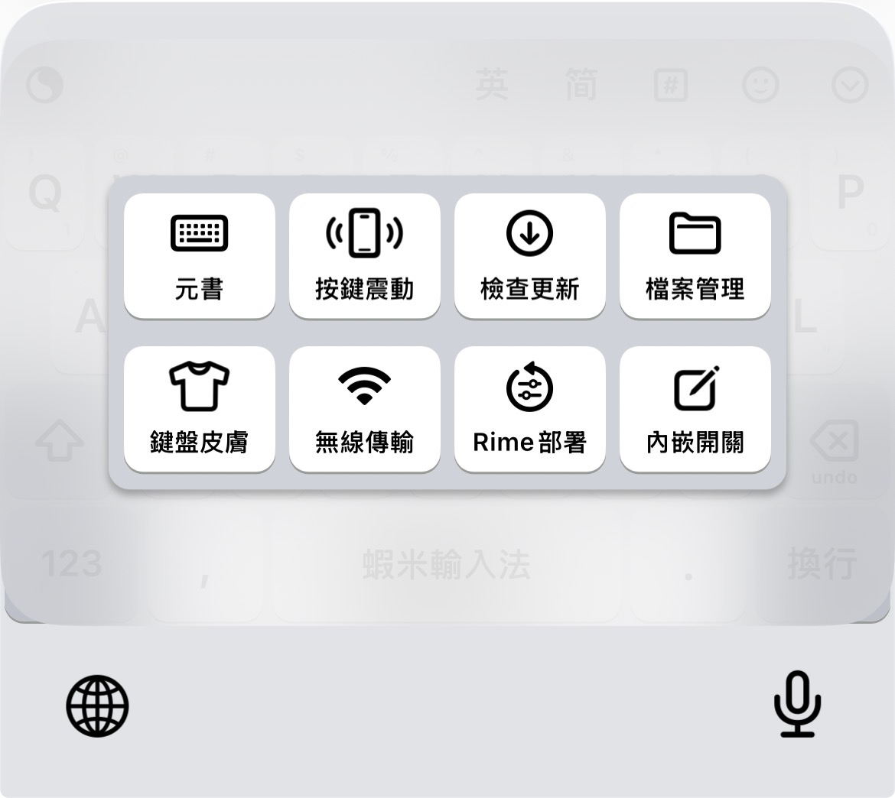
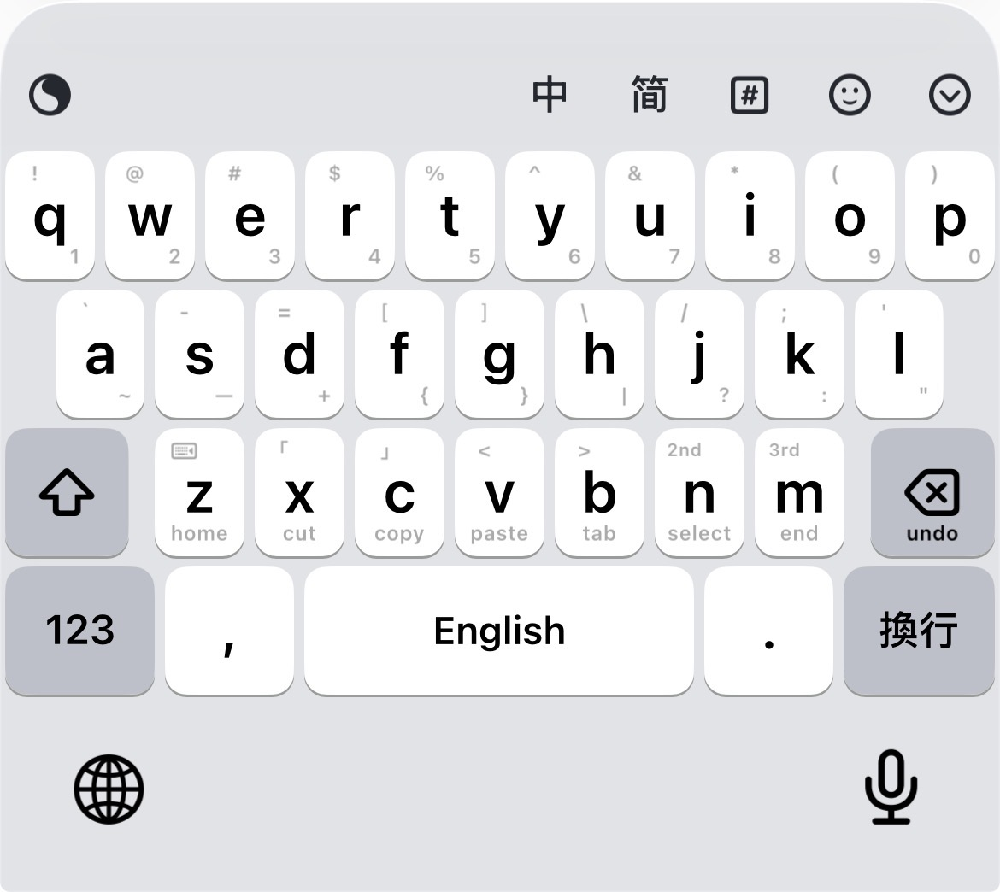
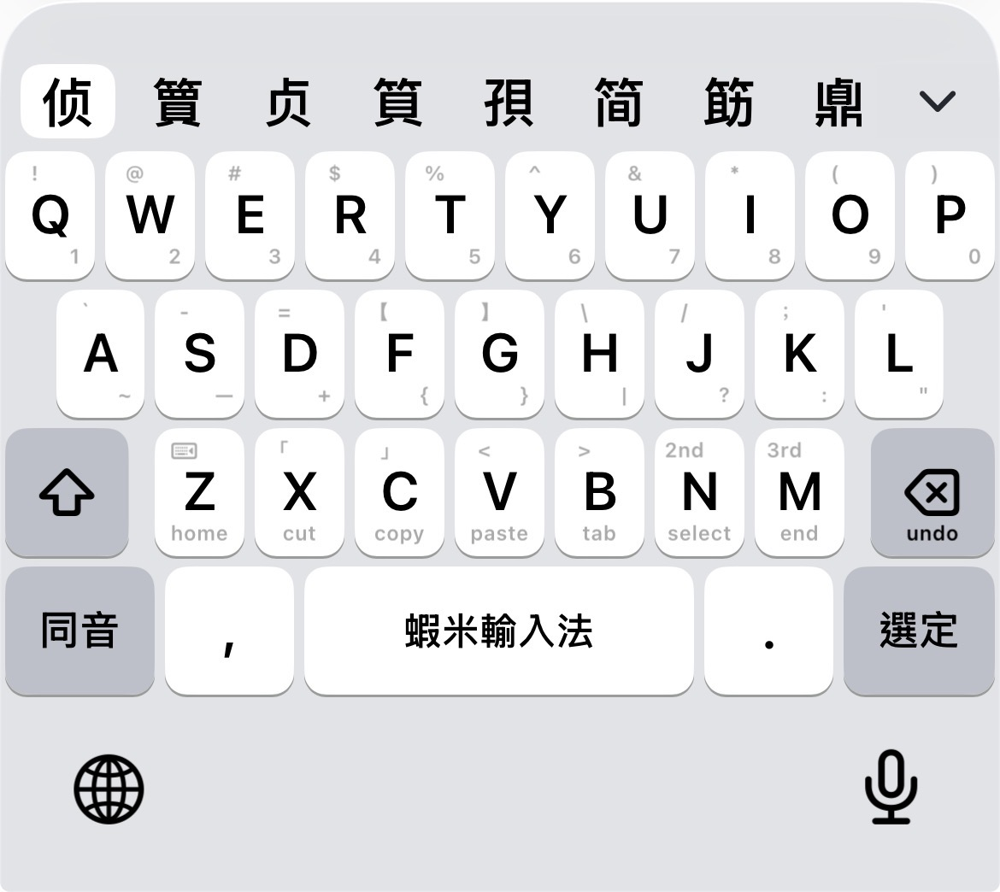
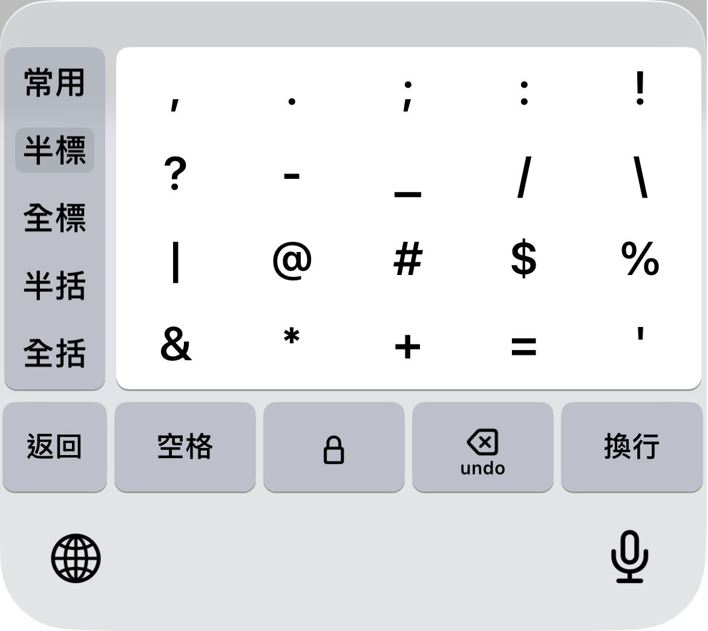
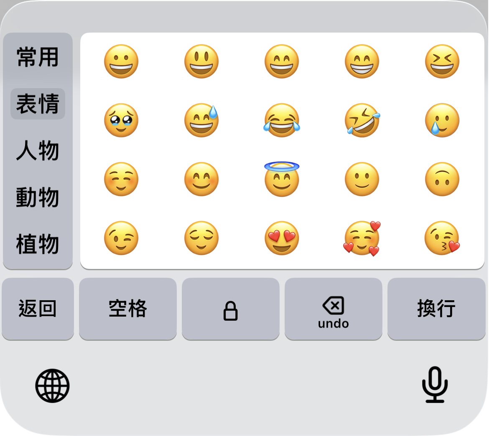
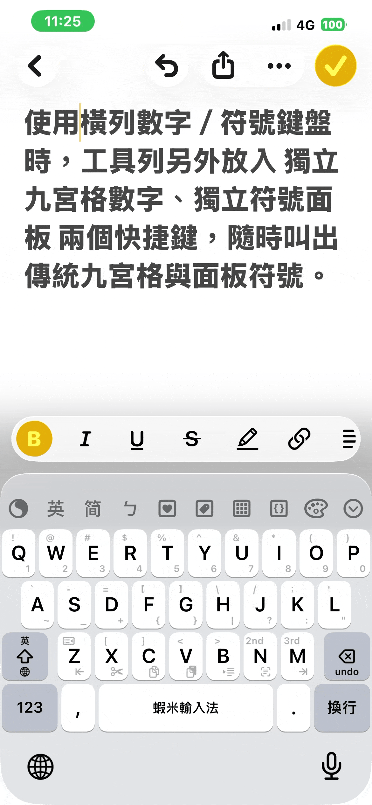

# 工具列

工具列共 **10** 個槽位，可從 [皮膚設計器](https://ggininder.work/r/Ryan)「[工具配置](https://ryanwuson.github.io/rime-liur-ios-new-skin/guide/#/settings/toolbar-config)」自訂。除下列常見項目外，尚可加入：**顏文字**、**注音（ㄅ）**、**拼音（拼）**、**獨立九宮格數字**、**獨立符號面板**、**皮膚設計器** 等。

## 1. 設定面板

關於元書輸入法的相關設定。

## 2. 中英／英文切換

依皮膚設定，可能為切換純英文 26 鍵，或切換至 **詞庫英文**（Easy English）。

## 3. 簡繁轉換

快速切換及輸入繁體、簡體中文。

## 4. 符號鍵盤

切換至符號面板；分類優化為 **半標、全標、半括、全括** 等。

## 5. Emoji 鍵盤

## 6. 鍵盤收折

隱藏鍵盤。

## 7. 獨立九宮格／符號面板

若設計器設為「橫列數字＋橫列符號」，可在工具列放入 **獨立九宮格數字**、**獨立符號面板** 快捷鍵。

## 8. 返回鍵滑回蝦米

在符號、九宮格、橫列數字／符號等鍵盤：iPhone **上滑「返回」**，iPad **下滑「返回」**，可快速回到 **蝦米中文鍵盤**。

