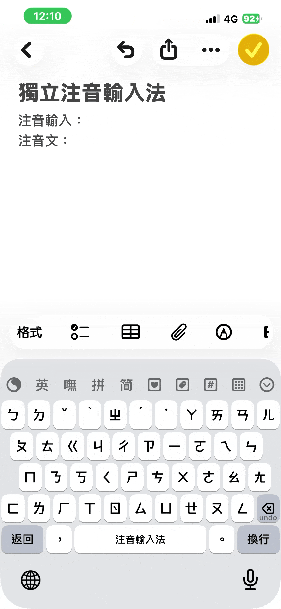
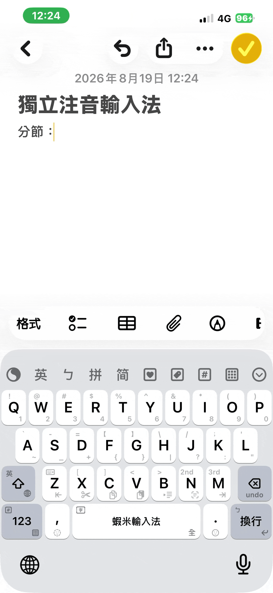
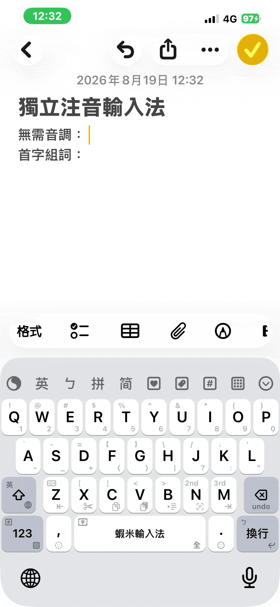

# 注音輸入

「注音鍵盤」是一套**獨立注音輸入法**（`liu_bpmf` 方案）。切換過去後，依鍵面注音符號直接打字、選字上屏，可連續輸入。切換方式見 [鍵盤佈局：注音鍵盤](/daily-use/keyboard-layout.md#注音鍵盤)。

## 基本操作

| 按鍵 | 功能 |
|------|------|
| 注音鍵位 | 依鍵面注音符號輸入 |
| 空白鍵 | **一聲**（不必另打聲調）；有候選時＝選字上屏 |
| Enter | 中文上屏 |
| Enter 上滑 | 注音文（直接輸出注音符號本身，例如 ㄊㄧˇ） |
| 返回（組字中） | 手動分節。例如「西岸」打成 `ㄒㄧ･ㄢ`；若不分節，會連成 `ㄒㄧㄢ`，變成「現」 |
| Backspace 下滑（組字中） | 刪除目前這條詞組記憶（再打出該詞、候選亮著時下滑；iPhone／iPad 皆同） |

- 空白鍵直接當一聲，二三四聲照鍵盤聲調鍵輸入。
- 可連續輸入多字再一次上屏。
- 只打每個字的**首碼**也可組詞，例如 `ㄅ ㄓ ㄉ` →「不知道」。
- 單字候選會附上蝦米字碼，方便一邊打注音、一邊學拆碼；詞組不提示。

## 分節

音節黏成別的字時，組字中「返回」鍵會變成 **分節**（iPhone／iPad 皆同），點按即可切開。例如「西岸」應打成 `ㄒㄧ･ㄢ`；若不分節，會連成 `ㄒㄧㄢ`，變成「現」。

## 首碼與無聲調

不必打完整注音。只打每個字的**首碼**即可組出詞，例如 `ㄅ ㄓ ㄉ` →「不知道」；也可以**不標聲調**，直接連續輸入注音符號選字。

## 詞組記憶

選過、上屏過的詞會被記住，之後用完整注音、無聲調或首碼再打時，常用詞會較容易出現。若要忘掉目前這條，組字中下滑 Backspace 即可刪除該詞組記憶。

## 讀音依據

讀音依目前的繁簡模式切換：

| 模式 | 讀音來源 |
|------|----------|
| 繁體 | 教育部《重編國語辭典修訂本》，並參考教育部《異體字字典》的音讀 |
| 簡體 | 《新華字典》 |

影響範圍包含 `;;` 讀音查詢，以及注音鍵盤顯示的讀音。

## 隨附 Emoji

使用注音鍵盤輸入時，候選會隨附對應的 Emoji，可直接選用。詳見 [隨附 Emoji](/features/emoji.md)。

## 相關

- [鍵盤佈局：注音鍵盤](/daily-use/keyboard-layout.md#注音鍵盤)
- [拼音輸入](/features/pinyin.md)
- [隨附 Emoji](/features/emoji.md)
