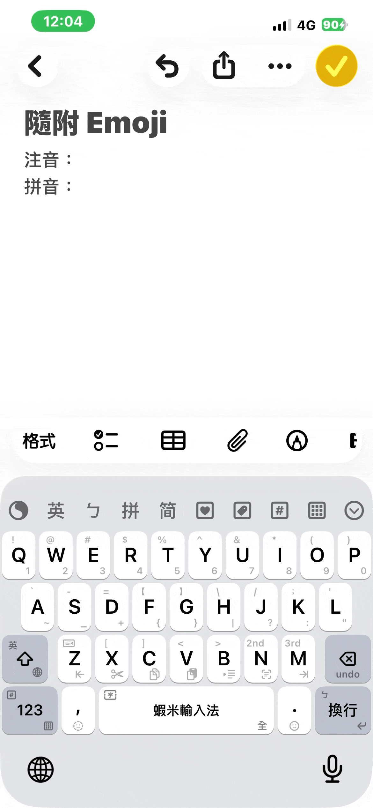

# 隨附 Emoji

以**注音／拼音鍵盤**輸入時，候選會**隨附對應的 Emoji**，可直接選用。這與工具列的「Emoji 鍵盤」（整片表情面板）是不同的功能。

## 觸發情境

| 情境 | 說明 |
|------|------|
| 注音鍵盤（獨立注音方案） | 以注音輸入時，候選隨附 Emoji |
| 拼音鍵盤（獨立拼音方案） | 以拼音輸入時，候選隨附 Emoji |

> 嘸蝦米主鍵盤的字碼候選不加 Emoji；隨附 Emoji 只在注音／拼音方案生效，預設開啟。

## 說明

- Emoji 以獨立候選附加，不會改寫原本的中文候選。
- 切換注音／拼音鍵盤的方式見 [注音輸入](/features/bopomofo.md)、[拼音輸入](/features/pinyin.md)。

## 相關

- [注音輸入](/features/bopomofo.md)
- [拼音輸入](/features/pinyin.md)
