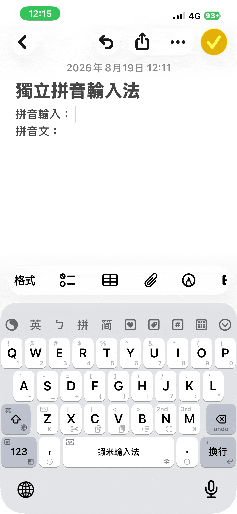
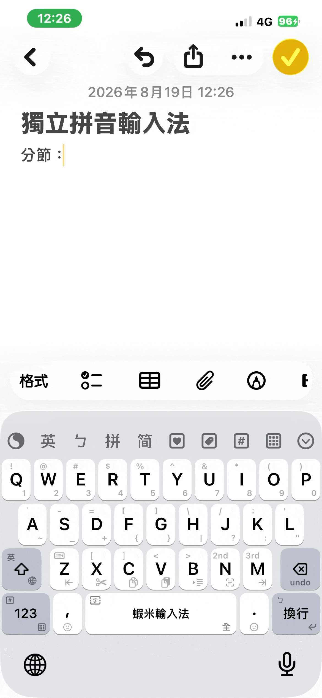
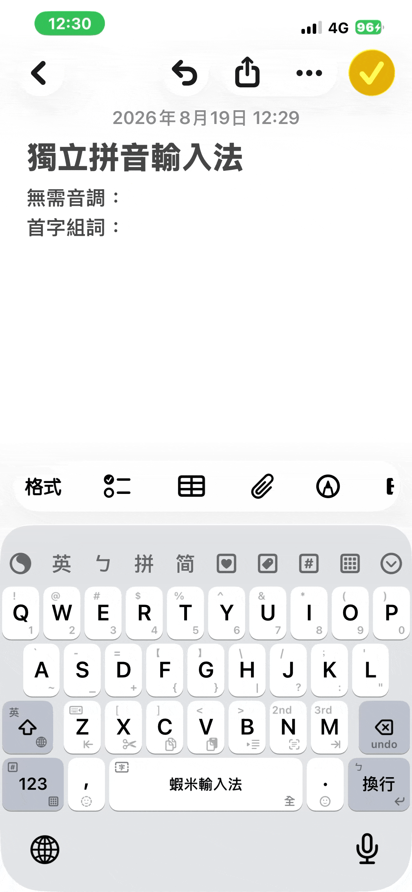

# 拼音輸入

「拼音鍵盤」是一套**獨立拼音輸入法**（`liu_pinyin` 方案）。切換過去後，直接以漢語拼音打字、選字上屏，可連續輸入。切換方式見 [鍵盤佈局：拼音鍵盤](/daily-use/keyboard-layout.md#拼音鍵盤)。

## 基本操作

| 按鍵 | 功能 |
|------|------|
| 拼音字母 | 輸入漢語拼音，可連續輸入 |
| 空白鍵 | 找字上屏（選第一個候選字） |
| Enter 上滑 | 帶音標拼音（有打 1～5 才標調，不自動補一聲） |
| 返回（組字中） | 手動分節。例如「西岸」打成 `xi･an`；若不分節，會連成 `xian`，變成「現」 |
| Backspace 下滑（組字中） | 刪除目前這條詞組記憶（再打出該詞、候選亮著時下滑；iPhone／iPad 皆同） |

- 支援數字 1～5（下滑 QWERT）鍵入聲調。
- 只打每個字的**首碼**也可組詞，例如 `p g` →「蘋果」。
- 單字候選會附上蝦米字碼，方便一邊打拼音、一邊學拆碼；詞組不提示。
- **舉例**：`binfenye2danwan2taibei` → 繽紛耶誕玩台北

## 分節

音節黏成別的字時，組字中「返回」鍵會變成 **分節**（iPhone／iPad 皆同），點按即可切開。例如「西岸」應打成 `xi･an`；若不分節，會連成 `xian`，變成「現」。

## 首碼與無聲調

不必打完整拼音。只打每個字的**首碼**即可組出詞，例如 `p g` →「蘋果」；也可以**不標聲調**（不必按 1～5），直接連續輸入拼音字母選字。

## 詞組記憶

選過、上屏過的詞會被記住，之後用完整拼音、無聲調或首碼再打時，常用詞會較容易出現。若要忘掉目前這條，組字中下滑 Backspace 即可刪除該詞組記憶。

## 隨附 Emoji

使用拼音鍵盤輸入時，候選會隨附對應的 Emoji，可直接選用。詳見 [隨附 Emoji](/features/emoji.md)。

## 相關

- [注音輸入](/features/bopomofo.md)
- [鍵盤佈局：拼音鍵盤](/daily-use/keyboard-layout.md#拼音鍵盤)
- [隨附 Emoji](/features/emoji.md)
