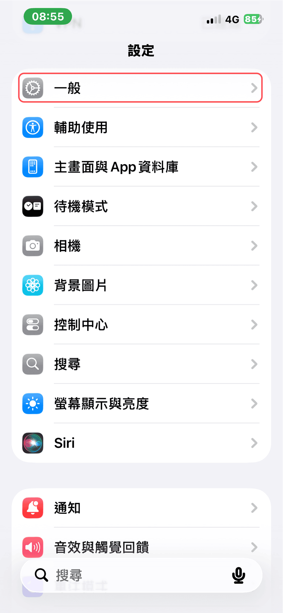
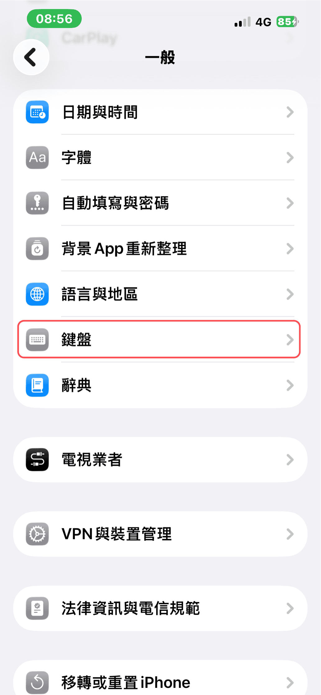
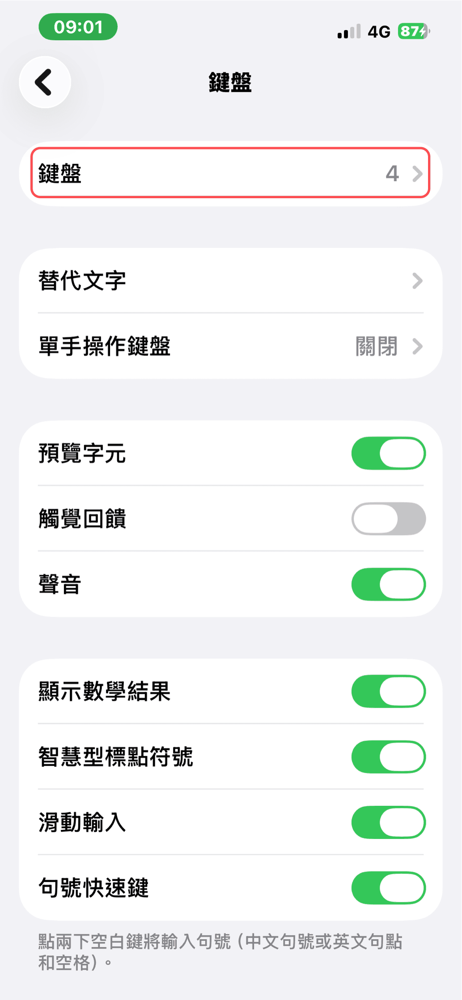
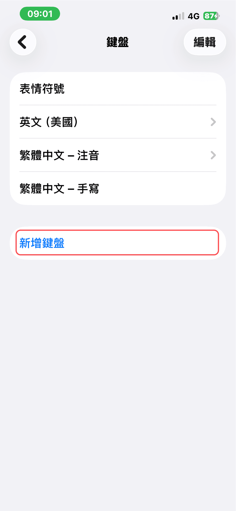
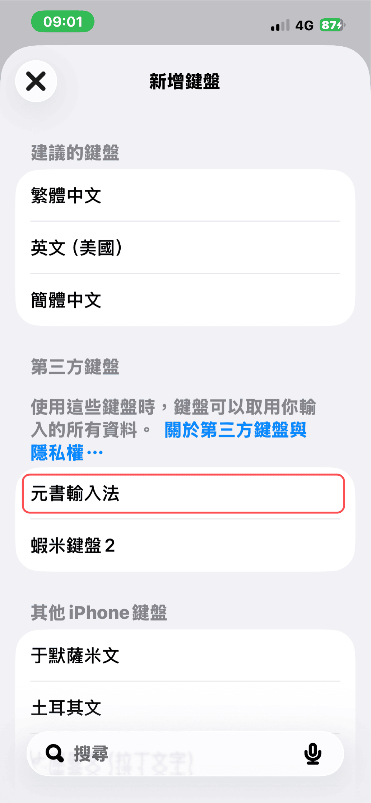
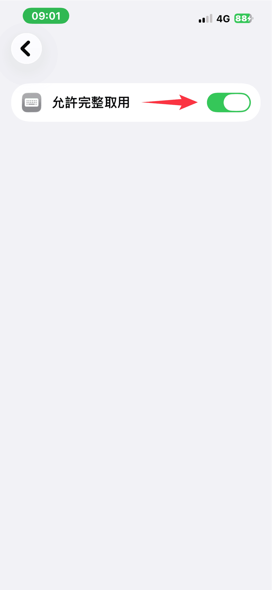
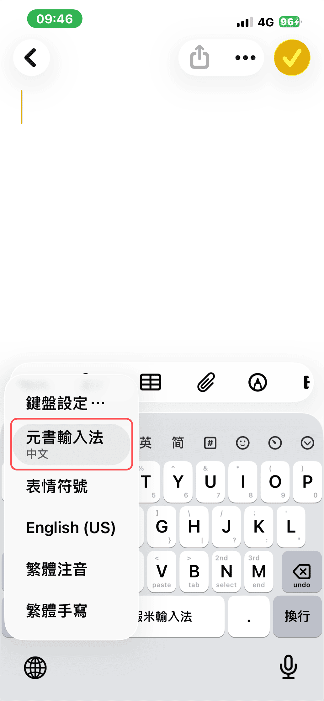
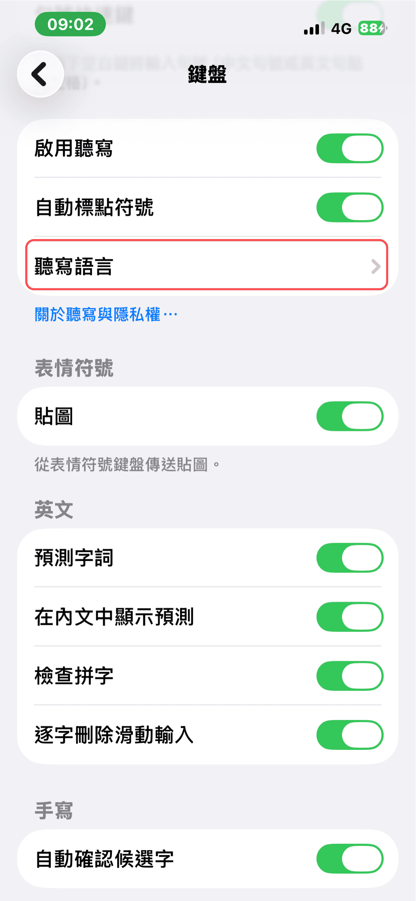
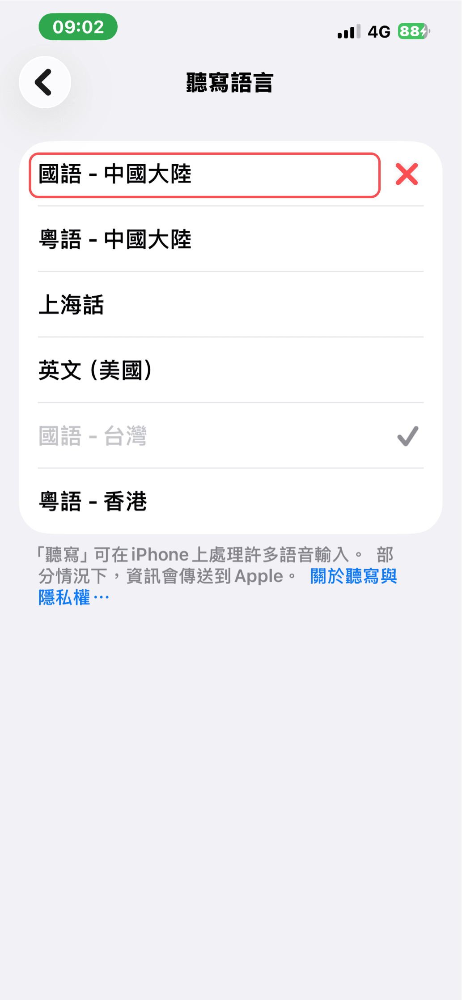

# 啟用輸入法

安裝元書輸入法後，須在系統設定中啟用鍵盤。

### 步驟 1：開啟設定

開啟「設定」App。

### 步驟 2：進入鍵盤設定

選擇「一般」→「鍵盤」→「鍵盤」。

### 步驟 3：新增鍵盤

點擊「新增鍵盤」。

### 步驟 4：選擇元書輸入法

在第三方鍵盤中選擇「元書輸入法」。

### 步驟 5：允許完整取用

開啟「允許完整取用」。

### 步驟 6：確認地球選單

若長按「地球」後，選單中沒有「元書輸入法」，請**重新開機**。

### 步驟 7：聽寫語言（建議）

選擇「一般」→「鍵盤」→「鍵盤」→「聽寫語言」。

### 步驟 8：取消國語－中國大陸

取消勾選「國語 - 中國大陸」。

## 下一步

- [選擇方案](/getting-started/choose-scheme.md)
- [手機安裝方案](/getting-started/install-scheme-phone.md)
