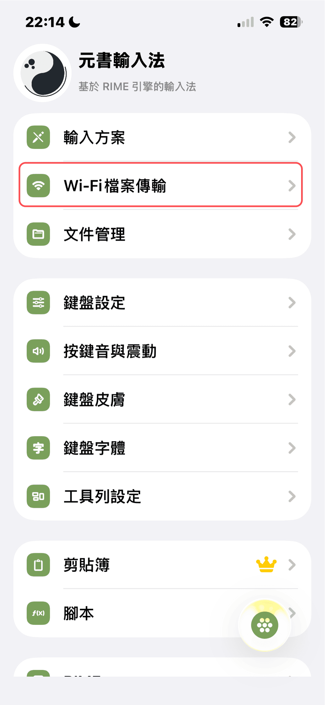
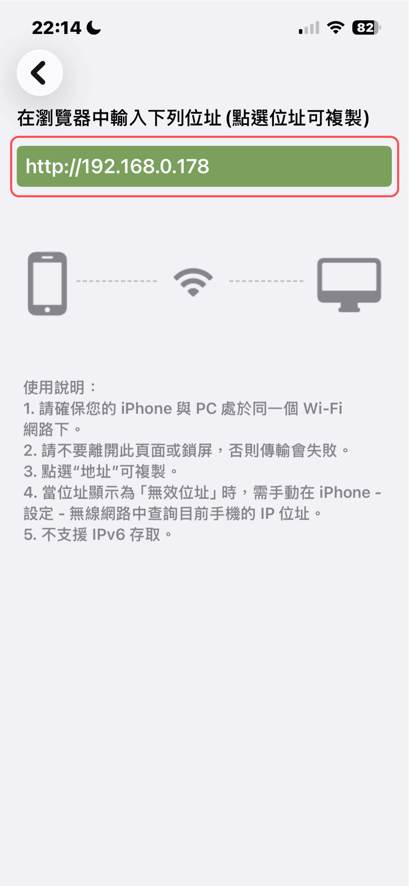
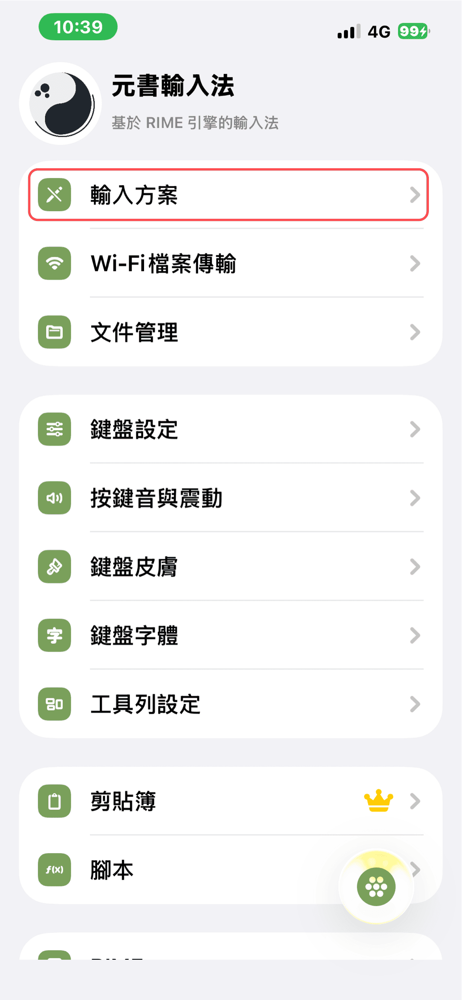
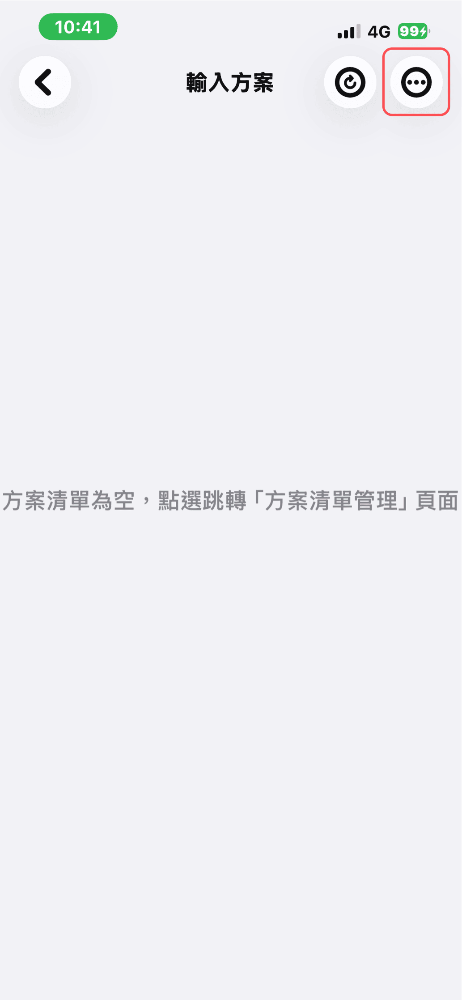
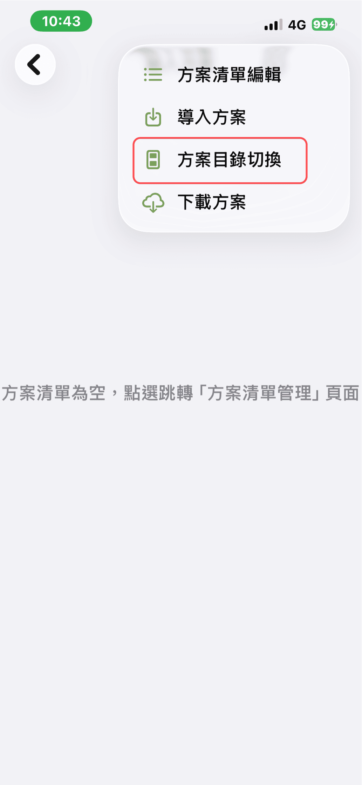
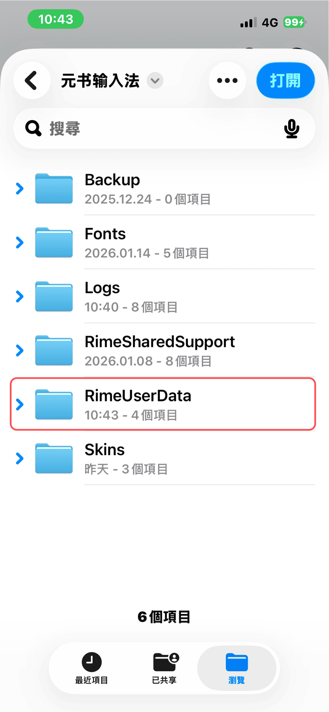
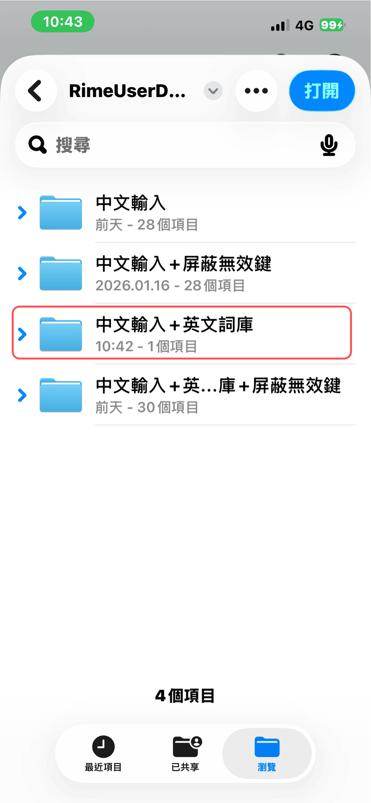
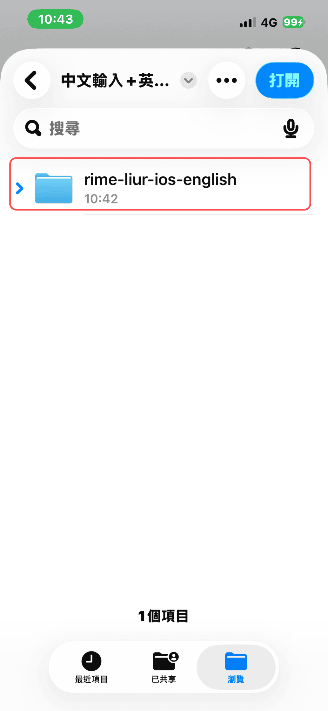
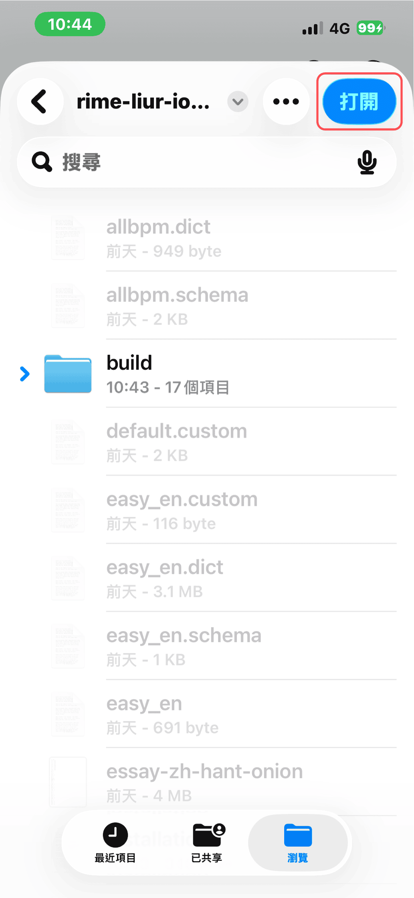
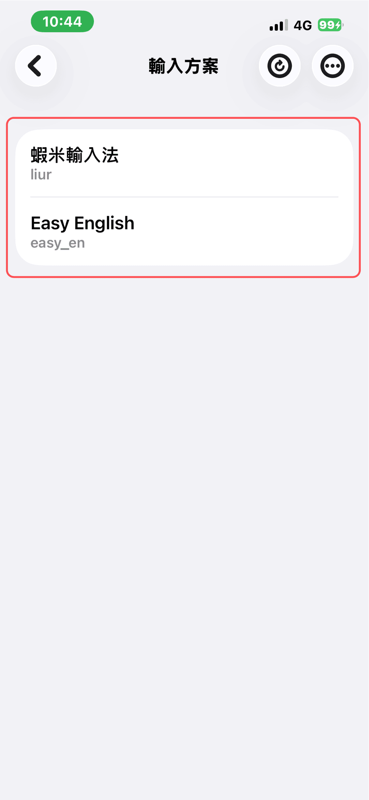

# 電腦安裝方案

透過 Wi‑Fi 將方案資料夾上傳至 iPhone 或 iPad（**不含皮膚**；皮膚請見 [電腦傳檔安裝皮膚](/skin/install-via-pc.md)）。

> **升級用戶：** 若已安裝舊版方案，請先 [刪除舊方案](/getting-started/remove-old-scheme.md) 再依下列步驟安裝。

## 步驟 1：下載並解壓縮方案

請先至 [選擇方案](/getting-started/choose-scheme.md) 選定方案，在電腦瀏覽器下載 zip 並解壓縮。

## 步驟 2：連接同一 Wi‑Fi

將電腦與 iPhone（或 iPad）連到**同一 Wi‑Fi**。

### 2-1 開啟元書輸入法

### 2-2 Wi‑Fi 檔案傳輸

進入 Wi‑Fi 檔案傳輸。

### 2-3 記下網址

記下畫面上的網址（每人不同），手機維持開啟並停留此頁。

### 2-4 電腦開啟網址

在電腦瀏覽器貼上並前往該網址，雙擊 **RimeUserData** 資料夾。

### 2-5 上傳資料夾

點擊右上角「↑」圖示，上傳解壓縮後的資料夾。

### 2-6 確認資料夾結構

## 步驟 3：手機開啟方案

回到 iPhone 或 iPad，選擇「輸入方案」。

點擊「方案目錄切換」。

依序選擇「RimeUserData」→ 方案名稱 →「rime-liur-ios」→「打開」。

## 下一步

- [方案開關設定](/getting-started/scheme-switches.md)（快打／強制快打常駐、關閉聯想字）
- [電腦傳檔安裝皮膚](/skin/install-via-pc.md)
- [元書輸入法基本設定](/yuanshu-settings/basic-settings.md)

## 注意事項

若元書輸入法更新後無法打字，請重新部署：

