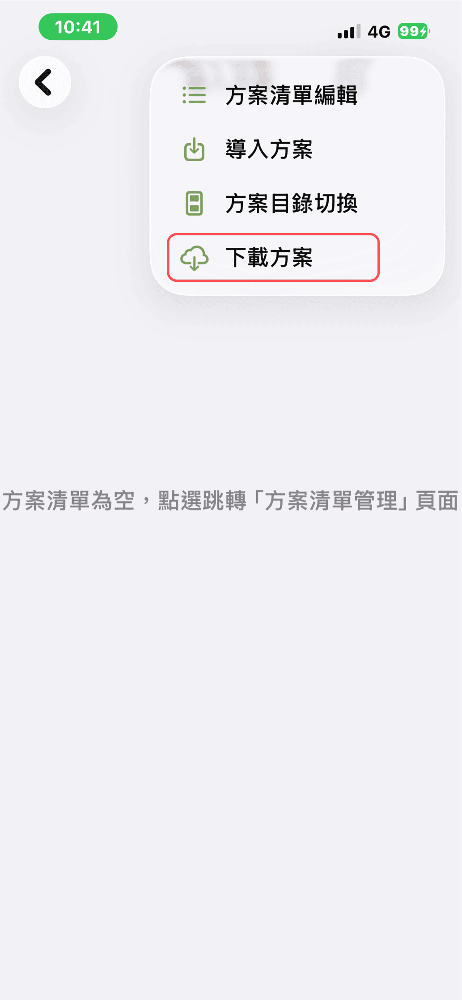
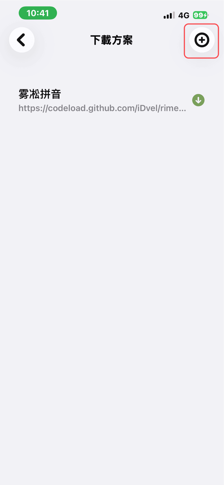
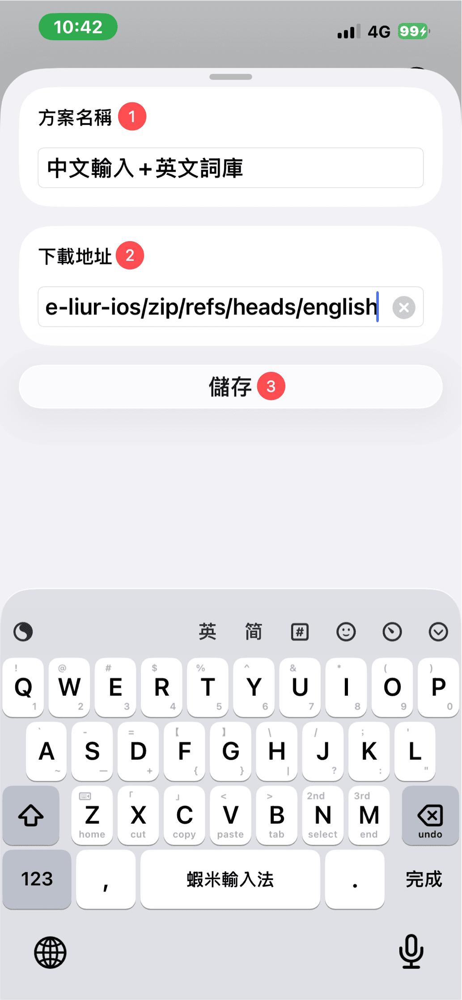
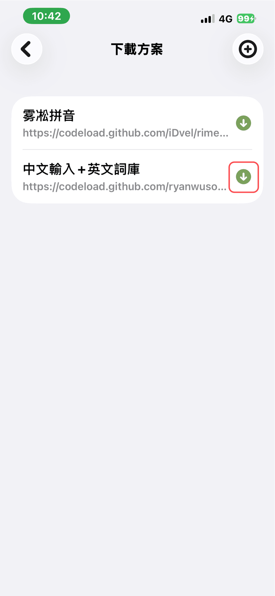
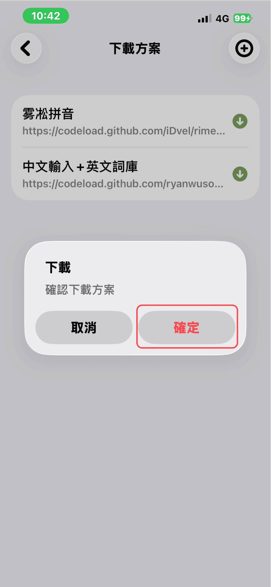
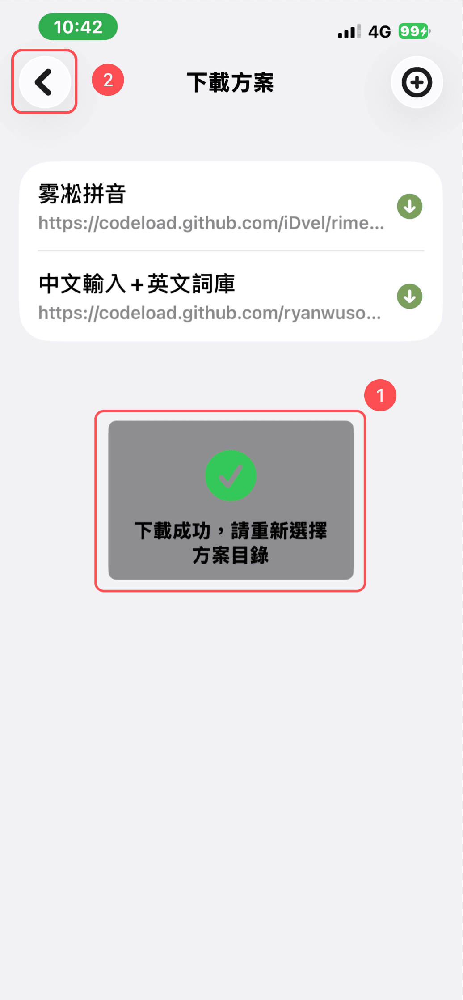

# 手機安裝方案

在 iPhone 或 iPad 上直接下載並匯入蝦米方案（**不含皮膚**；皮膚請見 [手機安裝皮膚](../skin/install-on-phone.md)）。

> **升級用戶：** 若已安裝舊版方案，請先 [刪除舊方案](getting-started/remove-old-scheme.md) 再依下列步驟安裝。

## 步驟 1：複製方案網址

請先至 [選擇方案](getting-started/choose-scheme.md) 複製適合的下載網址。

## 步驟 2：匯入元書輸入法

### 2-1 開啟元書輸入法

### 2-2 選擇「輸入方案」

### 2-3 點擊「下載方案」

### 2-4 點擊「㊉」新增下載

### 2-5 輸入名稱與網址

輸入「方案名稱（自訂）」、貼上「下載網址」並儲存。

### 2-6 下載並等待完成

點擊右方綠色按鍵下載，等待下載完成。

### 2-7 方案目錄切換

點擊「方案目錄切換」。

### 2-8 選擇 RimeUserData

依序選擇「RimeUserData」。

### 2-9 選擇方案名稱

選擇你自訂的「方案名稱」。

### 2-10 選擇 rime-liur-ios

選擇「rime-liur-ios」。

### 2-11 打開方案

點擊「打開」。

## 下一步

- [方案開關設定](getting-started/scheme-switches.md)（快打／強制快打常駐、關閉聯想字）
- [手機安裝皮膚](../skin/install-on-phone.md)
- [元書輸入法基本設定](../yuanshu-settings/basic-settings.md)

## 注意事項

若元書輸入法更新後無法打字，請重新部署：

