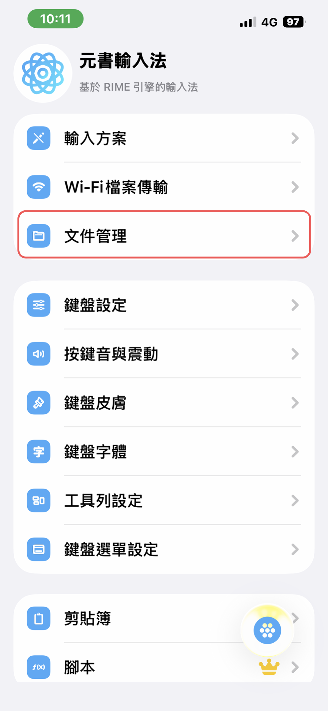
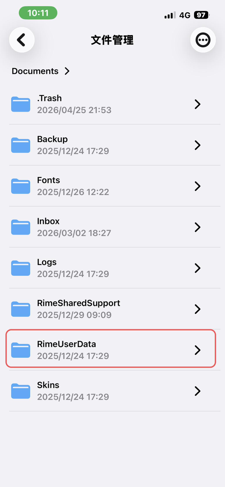
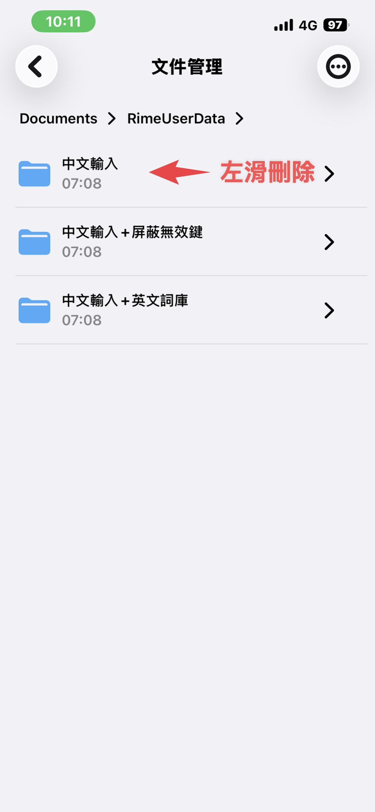

# 刪除舊方案（升級前）

若你已安裝過舊版蝦米方案，**建議先刪除再安裝新版**，避免殘留目錄或設定與新方案衝突。

新安裝、從未裝過方案者可略過本章，直接 [選擇方案](/getting-started/choose-scheme.md) 後安裝。

## 步驟 1：開啟文件管理

開啟元書輸入法，點選 **「文件管理」**。

## 步驟 2：進入 RimeUserData

依序進入 **Documents** → **RimeUserData**。

## 步驟 3：左滑刪除舊方案資料夾

在 `RimeUserData` 內，對舊版方案資料夾（例如「中文輸入」「中文輸入 + 屏蔽無效鍵」「中文輸入 + 英文詞庫」等）**左滑刪除**。

刪除完成後，再依 [手機安裝方案](/getting-started/install-scheme-phone.md) 或 [電腦安裝方案](/getting-started/install-scheme-pc.md) 安裝新版。

## 安裝後

若你先前有自訂 **快打提示常駐**、**強制快打常駐** 或 **關閉聯想字**，請見 [方案開關設定](/getting-started/scheme-switches.md) 重新操作。

## 相關

- [選擇方案](/getting-started/choose-scheme.md)
- [方案開關設定](/getting-started/scheme-switches.md)
