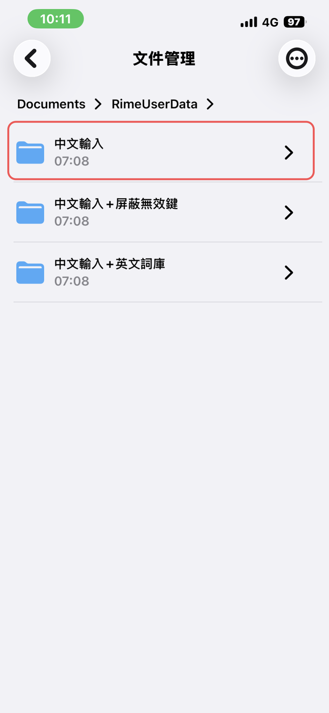
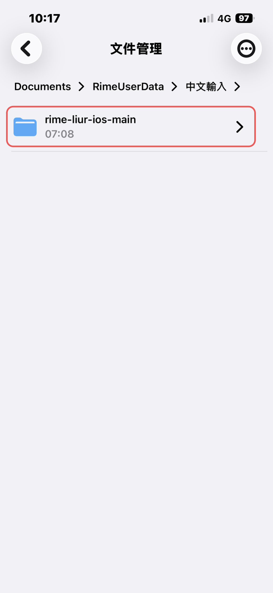
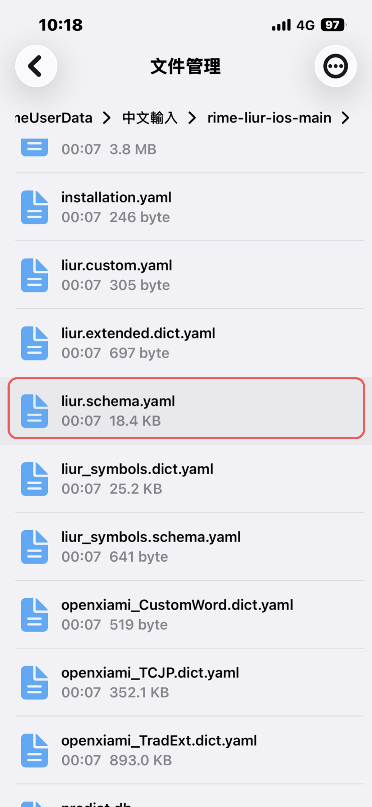
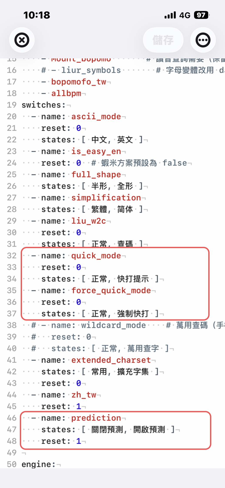
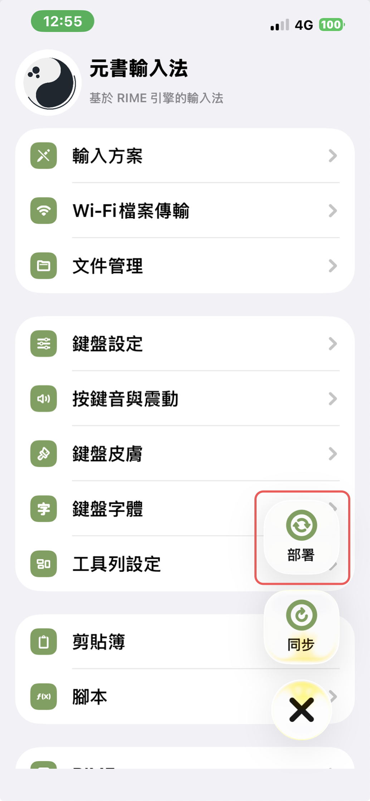

# 方案開關設定

升級或新安裝方案後，下列自訂**不會自動保留**，需重新編輯方案內的 `liur.schema.yaml`：

| 設定 | 說明 | 功能說明 |
|------|------|----------|
| 快打提示常駐 | `quick_mode` 的 `reset` 改為 `1` | [快打模式](/features/quick-mode.md) |
| 強制快打常駐 | `force_quick_mode` 的 `reset` 改為 `1` | [強制快打](/features/force-quick-mode.md) |
| 關閉聯想字 | `prediction` 的 `reset` 改為 `0` | [聯想字](/features/prediction.md) |

> 快打／強制快打須先開啟元書「候選 Comment」，見 [基本設定](/yuanshu-settings/basic-settings.md)。

## 開啟 liur.schema.yaml

### 步驟 1：文件管理

開啟元書輸入法，點選 **「文件管理」**。


### 步驟 2：進入 RimeUserData

依序進入 **Documents** → **RimeUserData**。


### 步驟 3：進入方案資料夾

點選你安裝時使用的方案名稱資料夾（例如「中文輸入」）。



### 步驟 4：進入 rime-liur-ios-main

點選 **rime-liur-ios-main**（或你實際的方案子資料夾名稱）。



### 步驟 5：開啟 liur.schema.yaml

點選 **liur.schema.yaml**。



## 快打提示常駐

1. 在 `switches:` 區段尋找 `name: quick_mode`
2. 將 `reset: 0` 改為 `reset: 1`（預設即為「快打提示」）

```yaml
- name: quick_mode
  reset: 1
  states: [ 正常, 快打提示 ]
```

## 強制快打常駐

1. 尋找 `name: force_quick_mode`
2. 將 `reset: 0` 改為 `reset: 1`（預設即為「強制快打」）

```yaml
- name: force_quick_mode
  reset: 1
  states: [ 正常, 強制快打 ]
```

## 關閉聯想字

1. 尋找 `name: prediction`
2. 將 `reset: 1` 改為 `reset: 0`（預設即為「關閉預測」）

```yaml
- name: prediction
  reset: 0
  states: [ 關閉預測, 開啟預測 ]
```

以上三項位置可對照下圖（紅框處）：



## 儲存並重新部署

1. 點右上角 **「儲存」**
2. 回到元書輸入法首頁，執行 **重新部署**



## 相關

- [快打模式](/features/quick-mode.md)
- [強制快打](/features/force-quick-mode.md)
- [聯想字](/features/prediction.md)
- [刪除舊方案（升級前）](/getting-started/remove-old-scheme.md)
