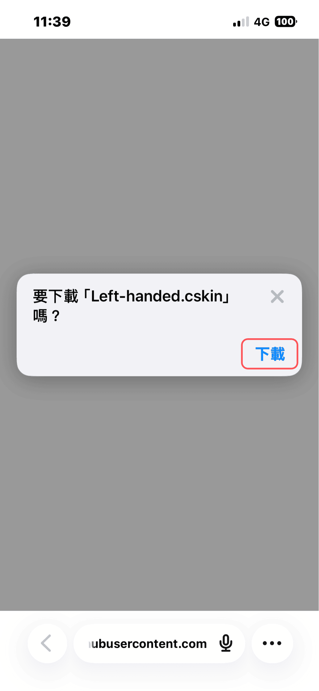
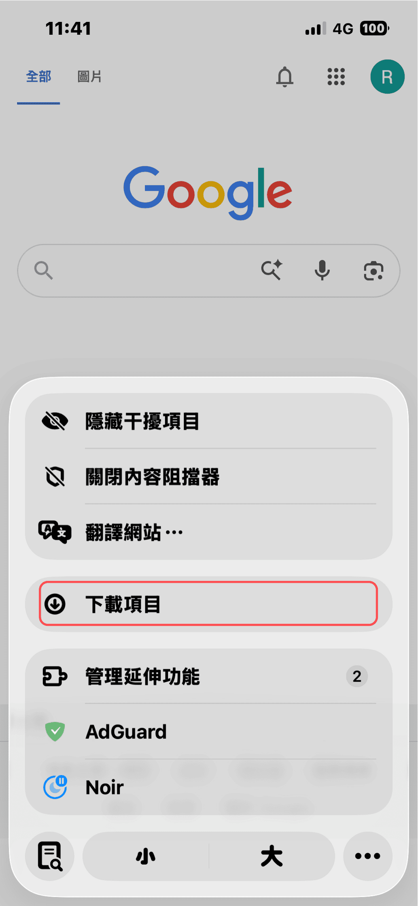
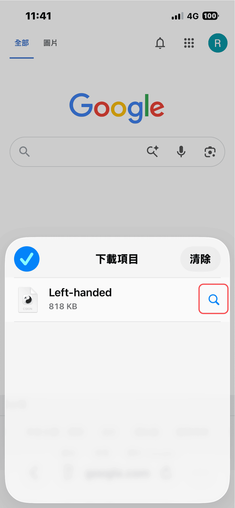
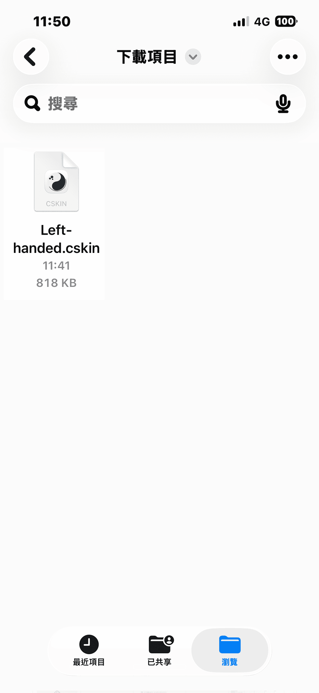
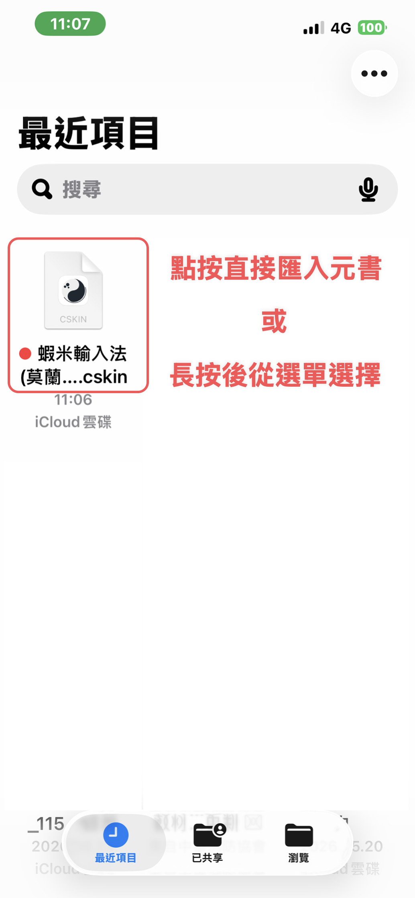
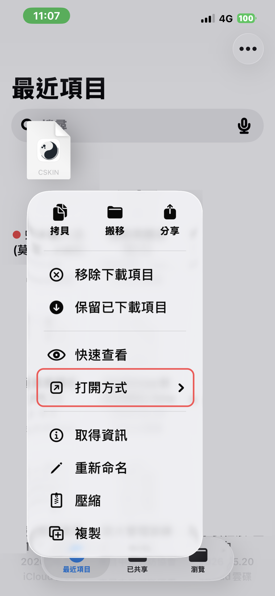
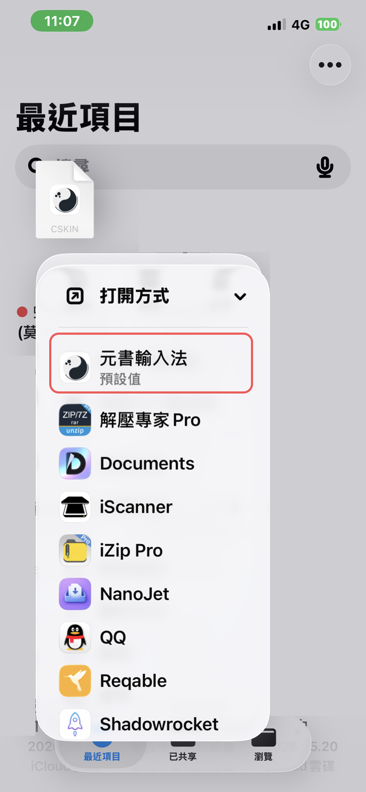

# 手機安裝皮膚

> 若還沒裝輸入方案，請先完成 [安裝入門](../getting-started/requirements.md)。  
> 若要在設計器裡改配色、佈局，請見 [皮膚設計器完整說明](https://ryanwuson.github.io/rime-liur-ios-new-skin/guide/#/)。本章只講**如何把皮膚裝進元書輸入法**。

## 安裝前請留意

- **請使用新版皮膚。** [2026-07 更新](../changelog/2026-07.md#皮膚部分)起，注音／顏文字／橫列數字符號、擴充工具列與新手勢等，需搭配**新版 `.cskin`** 才完整支援；沿用舊皮膚仍可打字，但無法使用上述新佈局與功能。
- **想直接用預設佈局？** 不必先自行調整設定。開啟 [蝦米輸入法皮膚設計器](https://ggininder.work/r/Ryan)，按右上角 **「導出配置（.cskin）」** 即可取得預設皮膚，再依下列步驟安裝進元書輸入法。

## 從設計器導出（手機）

### 步驟 1：開啟設計器

在 iOS 瀏覽器（建議 Safari）開啟 [蝦米輸入法皮膚設計器](https://ggininder.work/r/Ryan)。

設計器內請先 [編輯皮膚資訊](https://ryanwuson.github.io/rime-liur-ios-new-skin/guide/#/interface/top-bar?id=編輯皮膚資訊)（名稱、作者），再按右上角 **「導出配置（.cskin）」**。

### 步驟 2：下載 .cskin

按導出後會出現下載視窗。

### 步驟 3：儲存至「檔案」

將皮膚儲存至「檔案」App。

### 步驟 4：以元書輸入法開啟

若你的裝置已將 `.cskin` **預設以元書輸入法開啟**，在「檔案」App 中**點按檔案**即可匯入。

若預設不是元書輸入法（或點按後開啟了其他 App），請改為：

1. **長按** `.cskin` 檔案
2. 點選 **「打開方式」**
3. 選擇 **「元書輸入法」**

### 步驟 5：運行 main.jsonnet

長按「皮膚主題」，點擊 **「運行 main.jsonnet」**，即可使用。

## 分享與再次修改

- 導出的 `.cskin` 可分享給他人
- 若要修改自己或他人的皮膚：在設計器按 **「匯入配置」** 選取 `.cskin` 繼續編輯，再導出新檔（見 [設計器說明·匯入與導出](https://ryanwuson.github.io/rime-liur-ios-new-skin/guide/#/import-export)）
- **請保留 `.cskin` 檔**：匯入元書輸入法後仍須留存，日後才能再匯入設計器修改；設計器**無法**從手機上的皮膚逆向匯出設定

## 建議保留 .cskin

請留存導出的 `.cskin` 檔，以便日後再匯入設計器修改。

## 其他安裝方式

- [電腦傳檔安裝皮膚](install-via-pc.md)
