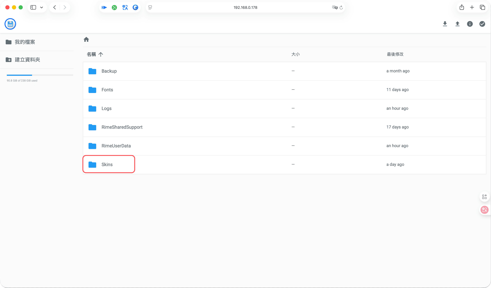
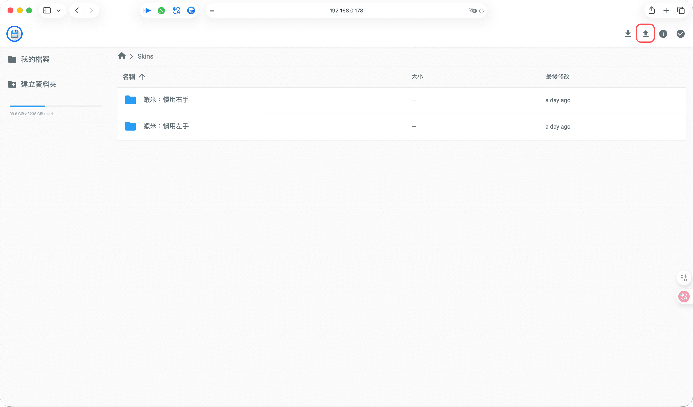
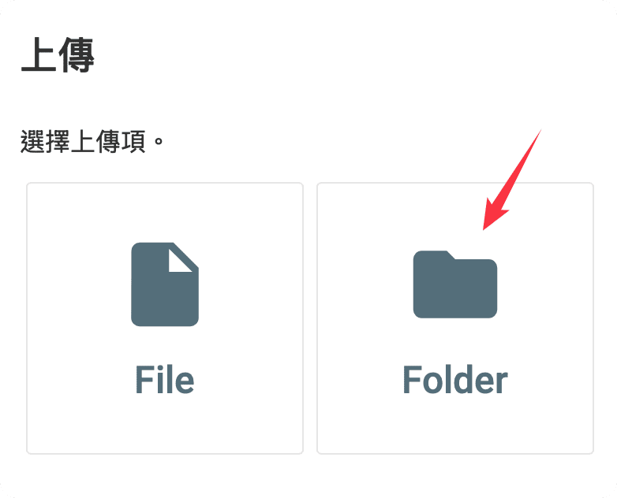
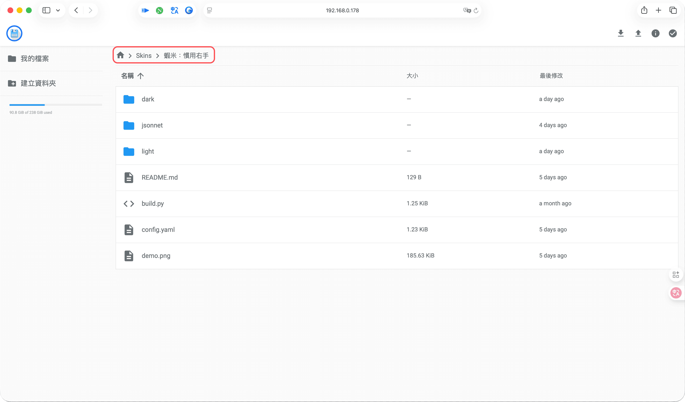
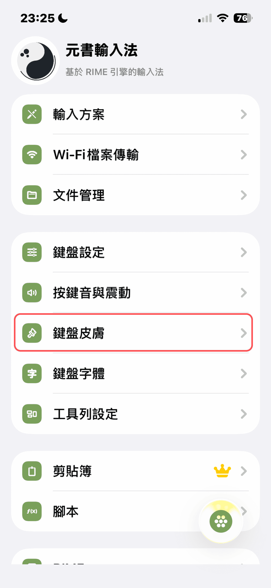

# 電腦傳檔安裝皮膚

> 若還沒裝輸入方案，請先完成 [安裝入門](../getting-started/requirements.md)。  
> 設計器操作請見 [皮膚設計器完整說明](https://ryanwuson.github.io/rime-liur-ios-new-skin/guide/#/)。

## 步驟 1：在電腦導出 .cskin

在電腦瀏覽器開啟 [蝦米輸入法皮膚設計器](https://ggininder.work/r/Ryan)，按 **「導出配置（.cskin）」** 下載。

**下載後，將 `.cskin` 副檔名改為 `.zip` 並解壓縮。**

## 步驟 2：Wi‑Fi 傳至 Skins 資料夾

手機與電腦須在**同一 Wi‑Fi**。若尚未設定 Wi‑Fi 傳檔，請先完成 [電腦安裝方案](../getting-started/install-scheme-pc.md) 中的 Wi‑Fi 傳輸步驟。

在電腦瀏覽器進入元書輸入法的 Wi‑Fi 頁面，雙擊進入 **Skins** 資料夾。

點擊右上角「↑」上傳解壓縮後的資料夾。

確認資料夾結構如下：

## 步驟 3：手機啟用皮膚

回到 iPhone 或 iPad，選擇「鍵盤皮膚」。

長按「皮膚主題」，點擊 **「運行 main.jsonnet」**。

## 分享與再次修改

- 導出的 `.cskin` 可分享給他人
- 若要修改自己或他人的皮膚：在設計器按 **「匯入配置」** 選取 `.cskin` 繼續編輯，再導出新檔（見 [設計器說明·匯入與導出](https://ryanwuson.github.io/rime-liur-ios-new-skin/guide/#/import-export)）
- **請保留 `.cskin` 檔**：匯入元書輸入法後仍須留存，日後才能再匯入設計器修改；設計器**無法**從手機上的皮膚逆向匯出設定

## 建議保留 .cskin

請留存導出的 `.cskin` 檔，以便日後再匯入設計器修改。

## 其他安裝方式

- [手機安裝皮膚](install-on-phone.md)
