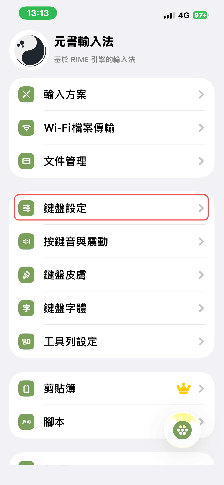
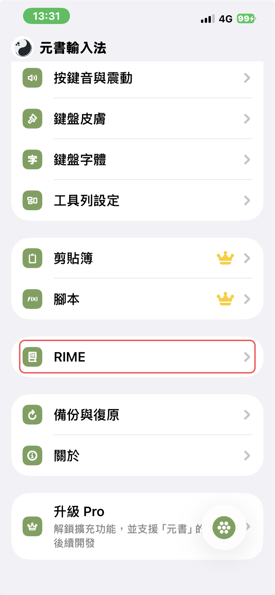
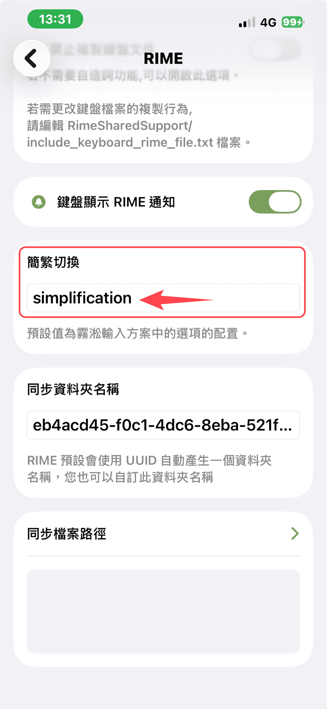

# 元書輸入法基本設定

## 鍵盤設定

位置：**鍵盤設定**

## 簡繁轉換

位置：**RIME**

**簡繁切換** → `simplification`

## 候選 Comment

開啟後，「vrsf 提示」、「讀音查詢」、「快打模式」等功能才會有提示字。

位置：**鍵盤設定** → **候選 Comment**：開啟

## 內嵌輸入模式

依個人習慣開啟或關閉：

- **開啟**：字根於游標顯示處
- **關閉**：字根於候選區

對照如下：

## 相關功能

需開啟候選 Comment 的功能：

- [快打模式](../features/quick-mode.md)（`,,sp`）
- [強制快打](../features/force-quick-mode.md)（`,,sf`）
- [讀音查詢](../reference/shortcuts.md)（`;;`）

若要**常駐**快打／強制快打，或**關閉聯想字**，見 [方案開關設定](../getting-started/scheme-switches.md)。
